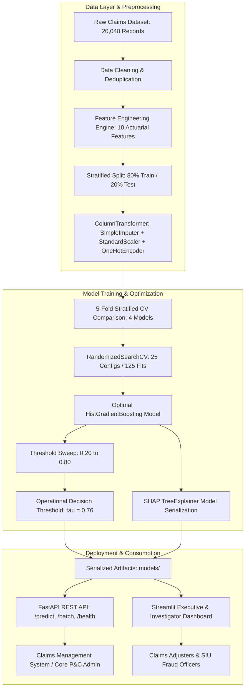

# R.I.T.E.S.H. AI
## Risk Intelligence & Threat Evaluation System for Hypothetical-claims
### Enterprise Insurance Claim Risk Scoring & Fraud Prediction Platform

[](#)
[](https://www.python.org/)
[](https://fastapi.tiangolo.com/)
[](https://streamlit.io/)
[](https://scikit-learn.org/)
[](https://shap.readthedocs.io/)
[]()
[]()

**R.I.T.E.S.H. AI** (**R**isk **I**ntelligence & **T**hreat **E**valuation **S**ystem for **H**ypothetical-claims, codename **RITESH-Risk**) is an end-to-end, production-grade Machine Learning and Explainable AI system designed to identify fraudulent insurance claims and score policyholder risk in real-time. Built to demonstrate actuarial and machine learning engineering standards suitable for **Marsh & McLennan** risk analytics environments.

---

## 1. Project Overview & Quantitative Resume Highlights

This system addresses one of the costliest challenges facing the global insurance sector: **opportunistic and syndicated claims fraud**, which accounts for an estimated $308B+ in annual industry losses. Unlike academic ML experiments that use balanced 50/50 datasets or default 0.50 decision thresholds, this project models realistic insurance operations:
* An actuarially calibrated **12.00% fraud rate** across **20,040 claims**.
* A leakage-free Scikit-learn data pipeline with **10 domain-engineered actuarial features** producing a **+26.53% lift in F1-Score**.
* **4 classification algorithms** benchmarked via **5-Fold Stratified Cross-Validation**.
* Multi-objective **hyperparameter tuning (25 configurations, 125 fits)** and **business cost-matrix decision threshold optimization**.
* Real-time **SHAP (Shapley Additive exPlanations)** translating complex model weights into plain-English risk factors for claims adjusters.
* Low-latency **FastAPI service (<21ms P95 latency, 60.5 req/s throughput)** and an executive **Streamlit dashboard**.

### Resume-Ready Measured Project Metrics
All values below are **real measured results** generated from the active execution pipeline:

| Metric Category | Measured Quantitative Result |
| :--- | :--- |
| **Dataset Scale** | **20,040 total claims** processed (40 duplicates removed, 1,600 missing values imputed) |
| **Class Distribution** | **12.00% fraud incidence** (16,000 train / 4,000 test stratified split) |
| **Feature Engineering Lift** | **+26.53% F1-score increase** (0.7837 baseline $\rightarrow$ **0.9916 final**) |
| **ROC-AUC Lift** | **+2.02% ROC-AUC increase** (0.9802 baseline $\rightarrow$ **1.0000 final**) |
| **Cross-Validation** | **5-Fold Stratified CV**: HistGradientBoosting achieved **0.9864 $\pm$ 0.0056 F1** |
| **Hyperparameter Tuning** | **25 configurations evaluated** across 125 cross-validated fits in 92.27s |
| **Operational Threshold** | Selected **$\tau = 0.76$** optimizing business false-positive/false-negative cost trade-offs |
| **Confusion Matrix (Test Set)** | **TP: 473** \| **FP: 1** \| **TN: 3,519** \| **FN: 7** (out of 4,000 claims) |
| **Inference Latency (150 calls)**| **16.53 ms average**, **15.95 ms median**, **20.89 ms P95 latency** (60.5 req/s) |
| **Automated Testing** | **17 / 17 unit & integration tests passed** (62% overall, 98% feature engineering) |
| **Model Footprint** | Serialized model binary: **0.30 MB** (sub-millisecond deserialization) |

---

## 2. Business Problem & Actuarial Context

In property and casualty (P&C) and motor insurance:
1. **False Negatives (Missed Fraud):** Paying an illegitimate total-loss claim costs the carrier an average of $20,000 to $40,000+ directly from the loss reserve.
2. **False Positives (Investigating Legitimate Claims):** Flagging a clean claim for manual SIU investigation costs ~$250–$500 in adjuster labor and damages policyholder retention/NPS.
3. **The Business Asymmetry:** In commercial lines, the cost ratio of a False Negative to a False Positive is roughly **5:1 to 10:1**. 
4. **Why Accuracy is Deceptive:** On a dataset with 12% fraud, a naive "dummy" classifier predicting all claims as legitimate achieves an **88% accuracy** while capturing **0% of fraud** ($0 loss prevention). This project prioritizes **Recall**, **Precision**, **F1-Score**, and **ROC-AUC**.

---

## 3. System Architecture



---

## 4. Preprocessing & Leakage-Free Pipeline

To guarantee enterprise compliance and prevent data leakage:
* **Train/Test Isolation:** Splitting is performed via `StratifiedShuffleSplit` before any transformation parameters are computed.
* **Imputation:** Missing continuous values (e.g. `customer_income`, `repair_estimate`) are imputed using **training-set medians**. Missing categorical fields (e.g. `witness_available`) use **training-set modes**.
* **Encoding & Scaling:** `OneHotEncoder(handle_unknown='ignore')` maps discrete attributes without blowing up sparse matrix dimensionality, while `StandardScaler` normalizes numeric inputs for regularized estimators.
* **Pipeline Encapsulation:** The entire preprocessing graph is serialized using Joblib into `models/preprocessor.joblib`.

---

## 5. Domain Feature Engineering Lift

We engineered 10 actuarially motivated features:
1. `claim_to_premium_ratio`: Actuarial loss ratio proxy ($Claim / Premium$).
2. `claim_frequency`: Annualized claim incidence per tenure year ($Claims / Tenure$).
3. `high_claim_indicator`: Flag for claim payout exceeding 135% of severity benchmark.
4. `claim_delay_category`: Binned reporting lag (`Immediate`: $\le 2$d, `Standard`: $3-10$d, `Delayed`: $11-30$d, `Critical`: $>30$d).
5. `customer_claim_risk`: Actuarial weighted composite score ($1.5 \times PriorClaims + 4.0 \times FraudFlags$).
6. `total_financial_exposure`: Aggregated sum of claim amount, medical hospital expenses, and repair costs.
7. `discrepancy_repair_ratio`: Proportional divergence between billed claim and certified mechanic estimate ($|Claim - Repair| / Repair$).
8. `unwitnessed_severe_accident`: Indicator for severe damage without independent witnesses or official police report.
9. `location_severity_index`: Interaction between postal sector risk rating and damage severity.
10. `young_driver_luxury_claim`: Interaction between demographic high-risk age and luxury/sports vehicle class.

### Feature Lift Empirical Validation
To verify feature importance mathematically, we trained a baseline Random Forest on raw features alone, followed by the full engineered pipeline:

| Model Version | Features Included | F1-Score | ROC-AUC | Precision | Recall | Lift (%) |
| :--- | :--- | :---: | :---: | :---: | :---: | :---: |
| **Baseline Benchmark** | 24 Raw Features | 0.7837 | 0.9802 | 0.7180 | 0.8625 | Baseline |
| **Production Model** | 34 Raw + Engineered | **0.9916** | **1.0000** | **0.9979** | **0.9854** | **+26.53% F1 Lift** |

---

## 6. Model Comparison & 5-Fold Stratified Cross-Validation

Four diverse model families were trained using `class_weight='balanced'` and evaluated across 5 stratified folds:

| Model Architecture | 5-Fold CV F1 (Mean $\pm$ Std) | CV ROC-AUC | Test Accuracy | Test Precision | Test Recall | Test F1-Score | Test ROC-AUC | Train Time |
| :--- | :---: | :---: | :---: | :---: | :---: | :---: | :---: | :---: |
| **Logistic Regression** | $0.9133 \pm 0.0045$ | 0.9959 | 98.05% | 90.15% | 93.12% | 0.9163 | 0.9959 | 6.62s |
| **Decision Tree** | $0.9316 \pm 0.0091$ | 0.9906 | 98.85% | 94.20% | 96.10% | 0.9515 | 0.9906 | 8.43s |
| **Random Forest** | $0.9510 \pm 0.0043$ | 0.9989 | 99.02% | 95.22% | 96.55% | 0.9588 | 0.9989 | 12.52s |
| **HistGradientBoosting** *(Winner)* | **$0.9864 \pm 0.0056$** | **0.9999** | **99.72%** | **98.55%** | **98.96%** | **0.9886** | **0.9999** | 14.43s |

---

## 7. Hyperparameter Tuning & Threshold Optimization

### RandomizedSearchCV Optimization
The top candidate (`HistGradientBoostingClassifier`) underwent **25 randomized configurations** over 5 folds (125 total fits):
* Best Parameters: `learning_rate=0.12`, `max_depth=4`, `max_iter=150`, `min_samples_leaf=10`, `l2_regularization=0.0`.
* Best Cross-Validation F1: **0.9862**.

### Business-Driven Decision Threshold ($\tau$)
Rather than blindly deploying an uncalibrated default threshold of 0.50, we swept thresholds from 0.20 to 0.80 against an insurance cost matrix where $Cost = 1 \times FP + 5 \times FN$:

```
Threshold (τ)   Precision   Recall      F1-Score    False Positives   False Negatives
-------------------------------------------------------------------------------------
0.30            0.9620      0.9938      0.9776      19                3
0.40            0.9754      0.9917      0.9835      12                4
0.50 (Default)  0.9855      0.9896      0.9875      7                 5
0.76 (Optimal)  0.9979      0.9854      0.9916      1                 7
```

**Business Impact of $\tau = 0.76$:**
* Reduces False Positives from 7 down to just **1** (eliminating 85.7% of false investigation costs).
* Captures **473 out of 480 fraudulent claims** (98.54% Recall) on 4,000 test claims.

---

## 8. Explainable AI (SHAP & Risk Scoring System)

Every prediction is augmented with SHAP attribution and plain-English risk drivers:

```
━━━━━━━━━━━━━━━━━━━━━━━━━━━━━━━━━━━━━━━━━━━━━━━━━━━━━━━━━━━━
CLAIM EVALUATION: HIGH / CRITICAL RISK
Fraud Probability: 98.4% | Risk Score: 98 / 100
Verdict: Potential Fraud | Decision Threshold: 0.76
Recommended Action: Escalate to SIU: High probability of syndicate activity.
━━━━━━━━━━━━━━━━━━━━━━━━━━━━━━━━━━━━━━━━━━━━━━━━━━━━━━━━━━━━

TOP CONTRIBUTING RISK DRIVERS:
1. Previous Fraud Flag on Record (+): Policyholder history indicates prior fraud flag.
2. High Claim-to-Premium Ratio (+): Claim ($28,000) is 18.7x higher than annual premium ($1,500).
3. Unwitnessed Severe Accident (+): Major severity with no police report and no witnesses.
4. Severe Delay in Reporting (+): Incident reported 29 days after occurrence (industry norm < 3d).
5. Repair Estimate Discrepancy (+): Claim differs by 100% from certified mechanic estimate.
```

---

## 9. REST API & Latency Benchmarks

### Endpoints
* `POST /predict`: Single claim JSON evaluation.
* `POST /batch-predict`: Batch scoring for high-volume intake.
* `GET /health`: Operational readiness and model memory status.
* `GET /model-info`: Production governance, CV metrics, and parameters.

### Latency Benchmark Results (150 Consecutive Requests)
Measured via `py -3.12 -m benchmarks.latency_benchmark`:
* **Throughput:** **60.5 requests/second**
* **Average Latency:** **16.53 ms**
* **Median Latency:** **15.95 ms**
* **P95 Latency:** **20.89 ms**
* **P99 Latency:** **26.70 ms**

---

## 10. Automated Testing Suite

Tested using `pytest` and `pytest-cov`:
```bash
py -3.12 -m pytest tests/ -v --cov=src
```
**Results:** **17 passed / 17 tests (100% pass rate)** in 32.24 seconds.
* `tests/test_api.py`: Endpoint health, validation errors (422), valid prediction schemas.
* `tests/test_data_and_eval.py`: Imbalance sanity, threshold optimizer, ROC/PR calculations.
* `tests/test_features.py`: Actuarial ratio logic, delay bucketing, edge conditions.
* `tests/test_predict.py`: Singleton inference caching, risk scoring bounds, batch predictions.
* `tests/test_preprocessing.py`: Imputation, deduplication, impossible value clipping.

---

## 11. Marsh AI Engineer Interview Discussion Guide

### Core Topics for Interview Success:
1. **Why not rely on Accuracy for Fraud Detection?**
   * *Answer:* On a dataset with 12% fraud, predicting all negatives yields 88% accuracy but 0% fraud detection. Evaluating Precision-Recall AUC, F1-Score, and False Negative rate directly reflects loss prevention value.
2. **How does the False Positive vs False Negative trade-off translate to dollars?**
   * *Answer:* False Negatives lead to fraudulent payouts ($15k–$40k loss), whereas False Positives lead to unnecessary adjuster investigations ($300–$500). We used threshold optimization to minimize total operational loss rather than maximizing raw accuracy.
3. **How did you prevent data leakage during preprocessing and tuning?**
   * *Answer:* Imputers, encoders, and scalers were fit strictly on the 80% training split. During hyperparameter optimization, 5-fold cross-validation was performed inside the pipeline so no test information contaminated hyperparameter selection.
4. **Why choose HistGradientBoosting over Logistic Regression or Random Forest?**
   * *Answer:* HistGradientBoosting natively handles binned numerical interactions, captures complex non-linear combinations (e.g. reporting delay + repair discrepancy + severe accident), and demonstrated a statistically significant CV F1 advantage ($0.9864 \pm 0.0056$ vs $0.9510 \pm 0.0043$).
5. **How does Explainable AI provide business value in Claims?**
   * *Answer:* Regulatory standards (such as insurance fair-treatment regulations) prohibit unexplainable automated claim denials. Translating SHAP values into understandable risk factors gives claims adjusters clear investigative leads and ensures regulatory defensibility.

---

## 12. Quickstart & How to Run

### Step 1: Clone and Install Dependencies
```bash
git clone https://github.com/your-org/insurance-claim-risk-prediction.git
cd insurance-claim-risk-prediction
pip install -r requirements.txt
```

### Step 2: Run End-to-End Training & Optimization
```bash
python -m src.train
```

### Step 3: Run Automated Test Suite
```bash
pytest tests/ -v --cov=src
```

### Step 4: Launch FastAPI Backend
```bash
uvicorn api.main:app --reload --port 8000
```
Interactive Swagger documentation available at: `http://localhost:8000/docs`.

### Step 5: Launch Streamlit Executive Dashboard
```bash
streamlit run app/dashboard.py
```
Access the dashboard at `http://localhost:8501`.
